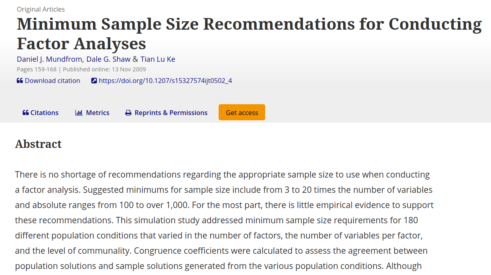

class: inverse, center, middle

# Método Montecarlo

```{r setup, include=FALSE}
options(htmltools.dir.version = FALSE)

knitr::opts_chunk$set(fig.align = "center",
                      message = FALSE,
                      warning = FALSE,
                      echo = FALSE
                      )
source("functions/bibliografia.R")
library(RefManageR)
BibOptions(check.entries = FALSE, 
                       bib.style = "authoryear", 
                       style = "markdown",
                       dashed = TRUE)
bib <- ReadBib("references.bib")
```

```{r xaringan-themer, warning=FALSE, include=FALSE}
library(xaringanthemer)
style_mono_light(
  base_color = "#23395b",
  code_font_google   = google_font("Fira Mono")
)
```

```{r xaringanExtra, echo=FALSE}
#devtools::install_github("gadenbuie/xaringanExtra")
xaringanExtra::use_xaringan_extra(c("tile_view", "animate_css", "tachyons"))

xaringanExtra::use_editable(expires = 1)

xaringanExtra::use_logo(
  image_url = "img/logo.png",
  link_url = "https://medicionpsicologica.com/",
  width = 150,
  height = 150
)

xaringanExtra::use_clipboard(
  button_text = "Copiar",
  success_text = "Copiado",
  error_text = "Presiona Ctrl+C para copiar"
)

xaringanExtra::use_fit_screen()

xaringanExtra::use_extra_styles(
  hover_code_line = TRUE,         #<<
  mute_unhighlighted_code = FALSE  #<<
)
```

---
class: middle

.pull-left[.font120[.line-space1-5[
*Es el uso de procesos aleatorios para cuantificar y estudiar distribuciones aleatorias, y a partir de ello analizar y comparar procedimientos estadísticos así como comportamientos de datos en sistemas más complejos `r AutoCite(bib, "gentle_monte_2005")`.* 
]]]

.pull-right[
```{r, out.width="100%"}
knitr::include_graphics("img/ruleta.jpg")
```
]

---

## Para ello necesitamos:

.pull-left[.line-space2-0[
- Software para simulación
- Obtener aleatoriamente datos
- Distribución o fórmula subyacente a esa intención
- Condiciones
- Replicaciones
- Evaluación
]]


.pull-right[
```{r echo=FALSE}
knitr::include_graphics('img/normal_simulada1.gif')
```
]

---
### Software simulación

Existen diversos softwares de costo para realizar simulación de datos ([goldsim](https://www.goldsim.com/), [xlstat](https://www.xlstat.com/es/soluciones/funciones/simulacion), [vose](https://www.vosesoftware.com/Monte-Carlo-simulation.php), etc.), sin embargo tienen la limitación de restringirse a funciones y soluciones específicas de determinado sector de interés. Por ej. riesgos financieros. 

A fin de tener control total acerca de lo que se hará con los datos, condiciones y formas de evaluarlo, es recomendable utilizar un lenguaje de programación, entre los cuales puede estar C, C++, Ruby, Python, R, etc. 

Aunque R, es el lenguaje *más lento* entre los mencionados, es el más difundido en cuanto a análisis de datos (en un sentido similar con `python`) y de fácil entendimiento.


---
### Aleatoriedad de datos

Generar un número aleatorio es extremadamente complejo, y conlleva una serie de dificultades y requisitos que no solo se restrinjen al software `r AutoCite(bib, "park_random_1988")`, sino también al hardware.

Lo que obtenemos en el software son `números pseudo-aleatorios` puesto que parten de un mismo puerto (`semilla`) pre-determinada para generarse.

.pull-left[
```{r echo=TRUE}
round(runif(n = 2, min = 1, max = 5), 1) # Primer intento
round(runif(n = 2, min = 1, max = 5), 1) # Segundo intento
```
]

.pull-right[
```{r echo=TRUE}
set.seed(123) # Establecer semilla
round(runif(n = 2, min = 1, max = 5), 1) # Primer intento
set.seed(123)
round(runif(n = 2, min = 1, max = 5), 1) # Segundo intento
```
]

---

### Distribución o fórmula subyacente

.pull-left[
**Función de densidad para** $X \sim \mathcal{N}(\mu,\,\sigma^{2})\,.$


**Función de distribución para** $X \sim \mathcal{N}(\mu,\,\sigma^{2})\,.$

$F(x)=P(X≤x)$
]

.pull-right[
```{r echo=TRUE}
x <- seq(-3, 3, 1)
dens_norm <- dnorm(x, mean = 0, sd = 1)
dens_norm

pnorm(3, mean = 0, sd = 1)
pnorm(1.96, mean = 0, sd = 1)
qnorm(0.975, mean = 0, sd = 1)
```

]
---
### Distribución o fórmula subyacente

Con la función `rnorm()` se pueden generar números pseudo-aleatorios provenientes de una distribución normal. En base a esto se pueden realizar algunos ensayos.

.pull-left[
```{r echo=TRUE, message=FALSE, warning=FALSE}
library(tidyverse)
set.seed(123)
dist_normal <- tibble(Media = rnorm(n = 300,
                                    mean = 10,
                                    sd = 1.2))

grupo_a <- dist_normal %>% 
  sample_frac(size = 0.5) 

grupo_b <- dist_normal %>% 
  anti_join(grupo_a)

dist_normal <- bind_rows(grupo_a,
                         grupo_b) %>% 
  mutate(
    Grupo = c(rep("A", 150),
              rep("B", 150))
  )
```
]

.pull-right[
```{r fig.height = 4.5, fig.width = 6, dpi = 300, echo=FALSE}
dist_normal %>% 
  ggplot(aes(x = Media, fill = Grupo)) +
  geom_density(alpha = 0.6) +
  labs(
    y = "Densidad"
  ) +
  theme_bw() +
  theme(
    text = element_text(
      size = 11,
      face="bold"),
    axis.text = element_text(
      size = 11,
      face="plain",
      colour="black"),
    panel.background = element_rect(fill = "#e9ebee",
                                    size = 2, linetype = "solid"),
    panel.grid.major = element_line(size = 0.5, linetype = 'solid',
                                    colour = "#e9ebee"),
    panel.grid.minor = element_line(size = 0.25, linetype = 'solid',
                                    colour = "#e9ebee"),
    legend.background = element_rect(colour = NA, fill = "#e9ebee"),
    plot.background = element_rect(fill = "#e9ebee")
  )
```
]

---
### Distribución o fórmula subyacente

Ahora, el ensayo tiene la misma intención pero generando datos aleatorios desde 2 distribuciones distintas. Esto es lo que estaría evaluándose bajo la hipótesis de que ***hay diferencia de medias en 2 grupos***, que en esencia indica que los grupos provienen de distribuciones distintas.

.pull-left[
```{r echo=TRUE, message=FALSE, warning=FALSE}
dist_norm_A <- tibble(Media = rnorm(n = 150,
                                    mean = 10,
                                    sd = 1.2))

dist_norm_B <- tibble(Media = rnorm(n = 150,
                                    mean = 14,
                                    sd = 0.8))

dist_normal_dif <- bind_rows(dist_norm_A,
                             dist_norm_B) %>% 
  mutate(
    Grupo = c(rep("A", 150),
              rep("B", 150))
  )
```
]

.pull-right[
```{r fig.height = 4, fig.width = 6, dpi = 300, echo=FALSE}
dist_normal_dif %>% 
  ggplot(aes(x = Media, fill = Grupo)) +
  geom_density(alpha = 0.6) +
  labs(
    y = "Densidad"
  ) +
  theme_bw() +
  theme(
    text = element_text(
      size = 11,
      face="bold"),
    axis.text = element_text(
      size = 11,
      face="plain",
      colour="black"),
    panel.background = element_rect(fill = "#e9ebee",
                                    size = 2, linetype = "solid"),
    panel.grid.major = element_line(size = 0.5, linetype = 'solid',
                                    colour = "#e9ebee"),
    panel.grid.minor = element_line(size = 0.25, linetype = 'solid',
                                    colour = "#e9ebee"),
    legend.background = element_rect(colour = NA, fill = "#e9ebee"),
    plot.background = element_rect(fill = "#e9ebee")
  )
```
]

---

## Aplicaciones:

.line-space1-2[
- **Aprendizaje de estadística**
- **Investigación Metodológica**
  - Análisis del funcionamiento de estadísticos en investigación **empírica**. Ej:
      - Uso de t-student
      - Correlación de Pearson
  - Análisis del funcionamiento de estadísticos en investigación **psicométrica**. Ej:
      - Análisis factorial confirmatorio
      - Coeficiente omega y alfa
      - Índices de ajuste: CFI, TLI, RMSEA, SRMR
  - Funcionamiento de estadísticos en diferentes **condiciones**. Ej:
      - Tamaño de muestras distintos
      - Presencia de no-normalidad
      - Presencia de outliers
      - Data missing
]

---

### Aprendizaje de estadística

[](https://www.tandfonline.com/doi/full/10.1080/10691898.2020.1720551)

---

### Investigación metodológica

[](https://www.tandfonline.com/doi/full/10.1080/00949655.2010.520163)

---
### Investigación metodológica

<embed src="https://drive.google.com/viewerng/
viewer?embedded=true&url=http://www.de.ufpb.br/~ulisses/disciplinas/normality_tests_comparison.pdf" width="1100" height="500">
---
### Investigación metodológica

[](https://www.tandfonline.com/doi/full/10.1080/00949655.2010.520163)

---

# Ejemplos
