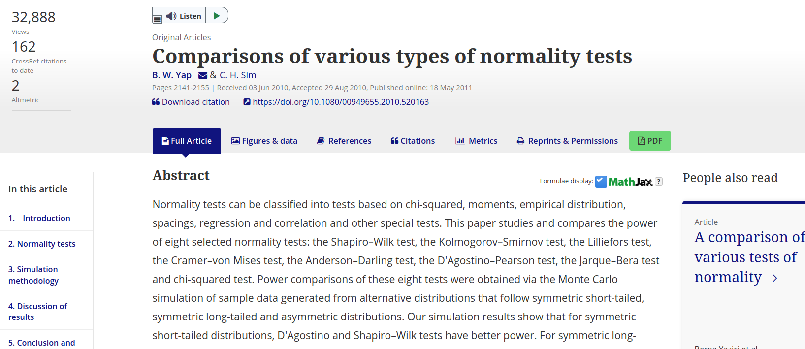

class: inverse, center, middle

# Método Montecarlo

```{r setup, include=FALSE}
options(htmltools.dir.version = FALSE)

knitr::opts_chunk$set(fig.align = "center",
                      message = FALSE,
                      warning = FALSE,
                      echo = FALSE
                      )
source("functions/bibliografia.R")
library(RefManageR)
BibOptions(check.entries = FALSE, 
                       bib.style = "authoryear", 
                       style = "markdown",
                       dashed = TRUE)
bib <- ReadBib("references.bib")
```

```{r xaringan-themer, warning=FALSE, include=FALSE}
library(xaringanthemer)
style_mono_light(
  base_color = "#23395b",
  code_font_google   = google_font("Fira Mono")
)
```

```{r xaringanExtra, echo=FALSE}
#devtools::install_github("gadenbuie/xaringanExtra")
xaringanExtra::use_xaringan_extra(c("tile_view", "animate_css", "tachyons"))

xaringanExtra::use_editable(expires = 1)

xaringanExtra::use_logo(
  image_url = "img/logo.png",
  link_url = "https://medicionpsicologica.com/",
  width = 150,
  height = 150
)

xaringanExtra::use_clipboard(
  button_text = "Copiar",
  success_text = "Copiado",
  error_text = "Presiona Ctrl+C para copiar"
)

xaringanExtra::use_fit_screen()

xaringanExtra::use_extra_styles(
  hover_code_line = TRUE,         #<<
  mute_unhighlighted_code = FALSE  #<<
)
```

---
class: middle

.pull-left[.font120[.line-space1-5[
*Es el uso de procesos aleatorios para cuantificar y estudiar distribuciones aleatorias, y a partir de ello analizar y comparar procedimientos estadísticos así como comportamientos de datos en sistemas más complejos `r AutoCite(bib, "gentle_monte_2005")`.* 
]]]

.pull-right[
```{r, out.width="100%"}

```
]

---

## Para ello necesitamos:

.pull-left[.line-space2-0[
- Obtener aleatoriamente datos
- Distribución o fórmula subyacente a esa intención
- Condiciones
- Replicaciones
- Evaluación
]]


.pull-right[

]


---


## Aplicaciones:

.line-space1-2[
- **Aprendizaje de estadística**
- **Investigación Metodológica**
  - Análisis del funcionamiento de estadísticos en investigación **empírica**. Ej:
      - Uso de t-student
      - Correlación de Pearson
  - Análisis del funcionamiento de estadísticos en investigación **psicométrica**. Ej:
      - Análisis factorial confirmatorio
      - Coeficiente omega y alfa
      - Índices de ajuste: CFI, TLI, RMSEA, SRMR
  - Funcionamiento de estadísticos en diferentes **condiciones**. Ej:
      - Tamaño de muestras distintos
      - Presencia de no-normalidad
      - Presencia de outliers
      - Data missing
]

---

### Aprendizaje de estadística

[](https://www.tandfonline.com/doi/full/10.1080/10691898.2020.1720551)

---

### Investigación metodológica

[](https://www.tandfonline.com/doi/full/10.1080/00949655.2010.520163)

---
### Investigación metodológica

<iframe src="https://www.researchgate.net/publication/267205556_Power_Comparisons_of_Shapiro-Wilk_Kolmogorov-Smirnov_Lilliefors_and_Anderson-Darling_Tests" width="100%" height="100%" frameBorder="0"></iframe>
---

# Ejemplos
